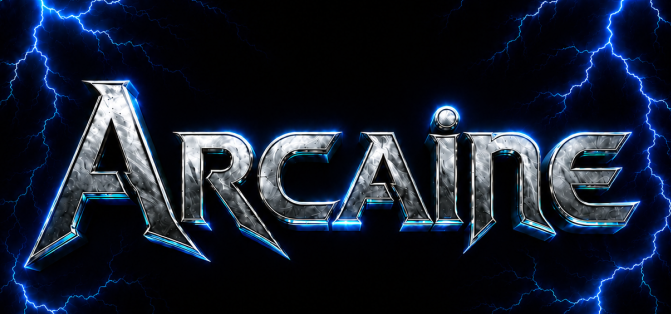

[](https://discord.gg/Bzz9hax9Jq)
[](https://huggingface.co/Echo9Zulu)


Arcaine is an inference engine builting using SYCL + oneDNN meant to deliver bleeding edge performance on intel devices with a focus on custom tooling, hardware specialized kernels and bespoke model implementations. 


Initial release implements

- multi gpu expert parallel,
- multi gpu layer splitting and
- NVFP4 support for DiffusionGemma using hand-optimized SPIR-V FP4/FP8 rescaling kernels + latest oneDNN support NVFP4 matmul and reorder
- small chat cli
- produce html visualizations that replay denoising steps with diffusion-gemma
- openai /v1/chat/completions for diffusiongemma
- tool call parser, validated with pi + tests
- llama bench style tool

It's early days and the project is expected to move quickly- there are a ton of details to iron out.

## Performance

For NVFP4 the current best performing set of env args is

```
DIFF_ROUTER_GPU_TOPK=on DIFF_SKIP_LAST_SOFT_NEXT=1 DIFF_PERSIST_XFER_STAGE=1 DIFF_SOFT_NEXT=topk:8 DIFF_ONEDNN_SDPA=decode
```
These are cobbled together but define the codepath taken at inference time; Arcaine currently contains many A/B style knobs for controlling behavior- so far this has been difficult to scale/maintain, so I expect changes.

## Supported Models

- DiffusionGemma [BF16](https://huggingface.co/google/diffusiongemma-26B-A4B-it)/[NVFP4](https://huggingface.co/RedHatAI/diffusiongemma-26B-A4B-it-NVFP4)/[W4A16](https://huggingface.co/pixelkaiser/diffusiongemma-26B-A4B-it-AWQ-MLP-W4A16-G64-S32-L1024)

- Gemma4-12B [BF16](https://huggingface.co/google/gemma-4-12B-it)


## Container setup

```bash
export RENDER_GID=$(getent group render | cut -d: -f3)
docker compose build
docker compose run --rm --service-ports \
  -v /mnt/Ironwolf-4TB/Projects/arcana/models:/workspace/models \
  dev   # interactive shell in /workspace
```

### Build

```bash
# Inside the dev container (see .devops/ for setup)
cmake -B build -G Ninja -DCMAKE_CXX_COMPILER=icpx
cmake --build build -j"$(nproc)"
```

The CMake targets add the NVFP4/DPAS SPIR-V translator extension at link time.
Do not pass `-Xspirv-translator` as a global compile flag; DPC++ will warn that
it is unused during normal host compilation.

For an B70 and maybe B50/B60 Battlemage build, add the SYCL target explicitly:

B60 and B50 might be intel_gpu_bmg_g21
```bash
cmake -B build -G Ninja \
  -DCMAKE_CXX_COMPILER=icpx \
  -DARCAINE_SYCL_TARGETS=intel_gpu_bmg_g31
cmake --build build -j"$(nproc)"
```


Doing the build makes a few binaries which all accept `--help`.


Host requirements: Linux, Intel GPU, `i915`/`xe` driver, `/dev/dri` present,
user in `render` group.

## OpenAI-compatible API server

`diffusion_server` loads one DiffusionGemma model and serves `GET /v1/models`
and `POST /v1/chat/completions`. Authentication is disabled by default; set
`ARCAINE_API_KEY` to require `Authorization: Bearer <key>`.

```bash
ARCAINE_API_KEY=local ./build/diffusion_server \
  --model models/diffusiongemma-26B-A4B-it-NVFP4 \
  --served-model-name diffusiongemma-26B-A4B-it-NVFP4 \
  --host 0.0.0.0 \
  --port 7461
```

```bash
curl http://127.0.0.1:7461/v1/models \
  -H "Authorization: Bearer local"
```

```bash
curl http://127.0.0.1:7461/v1/chat/completions \
  -H "Content-Type: application/json" \
  -d '{"model":"diffusiongemma-26B-A4B-it-NVFP4","messages":[{"role":"user","content":"Say hello in one sentence."}],"max_tokens":1000,"stream":true,"arcaine_stream_drafts":true}'
```

Streaming uses OpenAI-style append-only content deltas. Add
`"arcaine_stream_drafts":true` to receive custom `arcaine.diffusion_step` SSE
events with the mutable denoising canvas text.


## Notes

- oneDNN is built from source with `-DDNNL_CPU_RUNTIME=SYCL
  -DDNNL_GPU_RUNTIME=SYCL`. Mixing the binary distribution causes symbol
  conflicts — source build is required.
- If `diffusion_bench` reports an undefined oneDNN symbol such as
  `dnnl_primitive_attr_set_scales_v3`, re-run the CMake configure/build step so
  the binary embeds the `/opt/onednn/lib` runtime path ahead of oneAPI/OpenVINO
  library paths.
