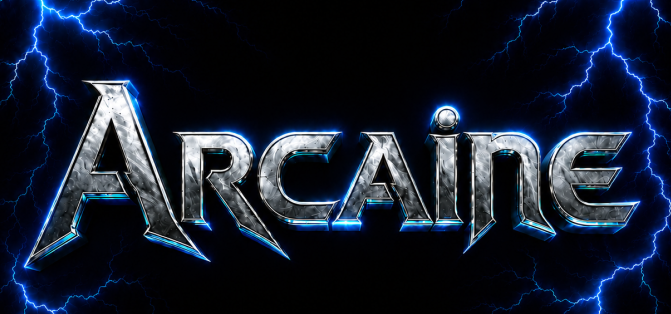

[](https://discord.gg/Bzz9hax9Jq)
[](https://huggingface.co/Echo9Zulu)


Arcaine is an inference engine builting using SYCL + oneDNN meant to deliver bleeding edge performance on intel devices with a focus on custom tooling, hardware specialized kernels and bespoke model implementations. 


Initial release implements

- multi gpu expert parallel,
- multi gpu layer splitting and
- NVFP4 support for DiffusionGemma using hand-optimized SPIR-V FP4/FP8 rescaling kernels + latest oneDNN support NVFP4 matmul and reorder
- small chat cli
- produce html visualizations that replay denoising steps with diffusion-gemma
- openai /v1/chat/completions for diffusiongemma
- tool call parser, validated with pi + tests
- llama bench style tool

It's early days and the project is expected to move quickly- there are a ton of details to iron out.

## Performance

For NVFP4 the current best performing set of env args is

```
DIFF_ROUTER_GPU_TOPK=on DIFF_SKIP_LAST_SOFT_NEXT=1 DIFF_PERSIST_XFER_STAGE=1 DIFF_SOFT_NEXT=topk:8 DIFF_ONEDNN_SDPA=decode
```
These are cobbled together but define the codepath taken at inference time; Arcaine currently contains many A/B style knobs for controlling behavior- so far this has been difficult to scale/maintain, so I expect changes.

## Supported Models

- DiffusionGemma [BF16](https://huggingface.co/google/diffusiongemma-26B-A4B-it)/[NVFP4](https://huggingface.co/RedHatAI/diffusiongemma-26B-A4B-it-NVFP4)/[INT4-AWQ](https://huggingface.co/cyankiwi/diffusiongemma-26B-A4B-it-AWQ-INT4)

- Gemma4-12B [BF16](https://huggingface.co/google/gemma-4-12B-it)

- Unsloth Qwen3.6-27B [NVFP4](https://huggingface.co/unsloth/Qwen3.6-27B-NVFP4)

- Qwen AgentWorld-35B-A3B [NVFP4](https://huggingface.co/Frosty40/Qwen-AgentWorld-35B-A3B-NVFP4)


## Docker Container setup

Pop into the dockerfile to see and modify the build arguments for `oneDNN`. These can be complex and adding new ones should not change application behavior.

You can check the `docker-compose.yaml` and `.devops/Dockerfile` to see Arcaine's setup and dependencies.


```
# Set the path to mount your models
export ARCAINE_MODELS=path/to/your/clankers/digital/flesh

```

```bash
# On the host
./docker.sh
```

### Build

```bash
# Inside the container
./build.sh
```

`build.sh` has a few comments which let you change the AOT sycl target. Arcaine implements some models which can work on both Alchemist and Battlemage, including device interop ie, mixing unmatched hardware, so choose what's appropriate for your device.  


Doing the build makes a few binaries which all accept `--help`.


### Host Requirements


Arcaine has not been tested on or developed for Windows OS. A few souls have had no issues getting Arcaine running in WSL. My goal is to use bleeding edge features in drivers, forks, patches etc, so latest `xe` is probably required.

Your host has the same requirements 


## arcaine-server

For now `arcaine_server` works like 

```bash
ARCAINE_API_KEY=local ./build/arcaine_server \
  --model models/diffusiongemma-26B-A4B-it-AWQ-INT4 \
  --served-model-name diffusiongemma-26B-A4B-it-INT4 \
  --host 0.0.0.0 \
  --port 7461
```

```bash
curl http://127.0.0.1:7461/v1/models \
  -H "Authorization: Bearer local"
```

```bash
curl http://127.0.0.1:7461/v1/chat/completions \
  -H "Content-Type: application/json" \
  -d '{"model":"diffusiongemma-26B-A4B-it-INT4","messages":[{"role":"user","content":"Say hello in one sentence."}],"max_tokens":1000,"stream":true,"arcaine_stream_drafts":true}'
```


>NOTE: DiffusionGemma currently does not support streaming to preserve compatability with other software. 


## arcaine-mbench

WIP. Goal is to provide a llama-bench style cli surface for kicking off benchmarks for all models Arcaine supports.


## arcaine-kbench

Arcaine is built by humans and agents. In GPU kernel development we need to keep things organized so a long running agent produces code a human can follow. Since I like to focus on data-flow and algorithms first, `arcaine-kbench` is intended to be a place where we can set a target kernel and send it shapes, initilize random weights, run iterations, profile gpus, A/B test env gates over approaches. This is very much under-construction and ideas are welcome for how to improve.


## Structured decisions: POST /v1/systemone

`arcaine_server` also serves Jev-format structured decision reads
(`POST /v1/systemone`) on the DiffusionGemma backend: each question is
answered from one single-step denoiser pass over a compiled answer canvas,
with per-label probabilities exact against the full vocabulary. Choice
supports 2–255 options, Score 2–10 levels, Noul returns a probability of yes.
Questions are isolated (separate prompt + canvas each) and run sequentially
under the model lock. The `confidence` field is a local normalized-entropy
approximation, not Jev's confidence; see the response headers and
[docs/systemone.md](docs/systemone.md) for the compatibility table, local
limits, read-policy settings, and validation status.

## Server-backed decision lab

`arcaine_server` serves an openjev/SemIf-style web UI at `/`. The page is a
thin client: it sends typed decisions to `/v1/systemone`, renders returned
probability bars and server timings, and does not use WebGPU or download model
weights. Static assets live under `third_party/web`.

Run it for an internal network:

```bash
ARCAINE_API_KEY=local ./build/arcaine_server \
  --model /path/to/diffusiongemma-checkpoint \
  --served-model-name arcaine-diffusiongemma \
  --host 0.0.0.0 --port 7461
```

Open `http://<server-lan-ip>:7461/` from another device. With the sample
command above, enter `local` in the API-key field. This value matches
`ARCAINE_API_KEY=local`. If the process is started
outside the repository, set `ARCAINE_WEB_DIR=/path/to/Arcaine/third_party/web`.
The API and UI share the same origin, so no CORS configuration is required.


## Notes

- oneDNN is built from source with `-DDNNL_CPU_RUNTIME=SYCL
  -DDNNL_GPU_RUNTIME=SYCL`. Mixing the binary distribution causes symbol
  conflicts — source build is required.
- If `diffusion_bench` reports an undefined oneDNN symbol such as
  `dnnl_primitive_attr_set_scales_v3`, re-run the CMake configure/build step so
  the binary embeds the `/opt/onednn/lib` runtime path ahead of oneAPI/OpenVINO
  library paths.
